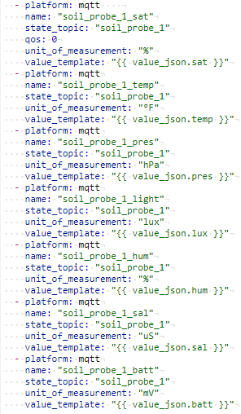
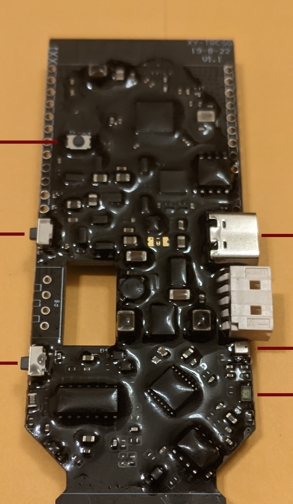

  <h3 align="center">LilyGo-HiGrow MQTT</h3><p align="center">


  <p align="center">
    T-Higrow ESP32 BME280 Firmware Update with MQTT, Deep Sleep Mode, and various bugfixes
<br />

<h4 align="center">Product Listing: https://www.aliexpress.com/item/32815782900.html </h4>

<h5 align="center">Factory firmware: https://github.com/Xinyuan-LilyGO/LilyGo-HiGrow </h5>


 </p>

<!-- Firmware Change List -->
## Firmware Change List

* BME 280 humidity value not displaying patched
* Soil Saturation Logic changed, more accurate percentage readings implemented
* Soil Saturation calibration values added to config
* Soil Saturation and Temperature validation added
* Polling interval added
* MQTT implemented to publish values of all sensor data
* Custom Wifi Hostname and MQTT Topic variable added
* Alternative Deep-Sleep Firmware version added


### Prerequisites

Please ensure to follow the original instructions found here to ensure your device is working properly:
https://github.com/Xinyuan-LilyGO/LilyGo-HiGrow


* PubSubClient library will need to be added for MQTT functionality.
  <br />

Copy the 'PubSubClient' directory located in 'lib' to 
```
<C:\Users\Your User Name\Documents\Arduino\libraries>
```

### Installation

Please edit the following configuration.h values:

* poll_interval - delay between polling sensors in milliseconds
* dry - value of soil probe when 100% dry 
* wet - value of soil probe when 100% wet
* device_id - unique name of device used for hostname and mqtt topic
* mqtt_server - mqtt server ip address
* mqtt_user - mqtt username
* mqtt_pass - mqtt password
* WIFI_SSID - Wifi SSID
* WIFI_PASSWD - Wifi Password

For deep sleep mode:
<br />
uncomment variables -
```sleepTime, running```

## Soil Saturation Calibration
1. Uncomment line 292 in 'src'
2. Upload sketch to device
3. View serial monitor and ensure soil saturation value is visible
4. Make sure probe is completely dry and update 'dry' variable in configuration with largest value seen
5. Fully submerge soil-probe portion of device into a small amount of water and update 'wet' value in configuration with smallest value seen
6. Comment line 292 in 'src'
7. Upload sketch to device

<!-- USAGE EXAMPLES -->
## Homeassistant Usage (Optional)

Add your current mqtt settings to home-assistant configuration. It should resemble something like this:


## Deepsleep Mode
To enable deep-sleep, uncomment deep sleep lines in configuration, delete 'src' sketch contents, copy/paste contents of 'deep_sleep' sketch into empty 'src' file and upload.
<br />

(Only toggle 'running' variable to enable/disable sleep mode for debugging purposes)

Note the webserver has been stripped out as well as some of the pushbutton features as this is a barebones sketch to enable MQTT
tranmsisson of sensor readings after prolonged periods of deep-sleep.

The default deep-sleep interval set to 30 minutes. Just FYI, I initially set it to 1 hour but experienced an overflow error which prevents the device from sleeping.

##Production Notes

Sometimes the soil saturation and temperature values report values outside of range for unknown reasons, some validation has been added to address this.
Salinity accuracy is unknown and temperature value should not be relied upon as well.

MQTT temperature has been converted to Fahrenheit in line 462 in src, just FYI.

Everything has been tested on the BME280 version of the T-grow probe, additional code modification may be required for the DHT-11 version.

## T-grow Mods
For indoor purposes no physical modifications need to made to the probe. 
<br />
However, for outdoor applications it's recommended that the pcb be potted to protect against the elements.

Example Epoxy used: https://amzn.to/3lQMfUo


[Epoxy at your own risk]

Notes on Epoxy Application: 

1. Verify your device is calibrated and working. Upload sketch to your probe before epoxying! (Just in case)
2. The BME280 sensor and LUX sensor are located on the bottom right portion of the probe. Be sure to be very careful to not get any epoxy on these sensors or else the readings may be compromised.
3. Before applying epoxy it's recommended to use a small amount of petroleum jelly to create a barrier around the push buttons and USB-C port to prevent epoxy intrusion.

<br />
<br />
<br />
<h6 align="center">Okay, best of luck with your plants! May the odds be in your favor ;)</h6>

